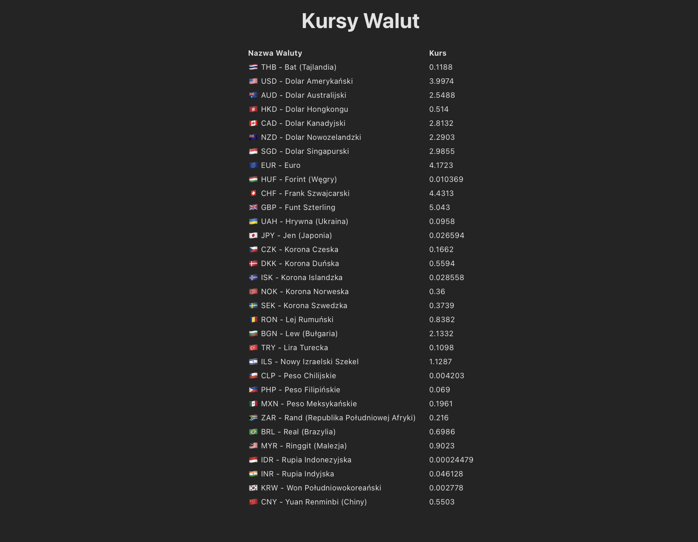
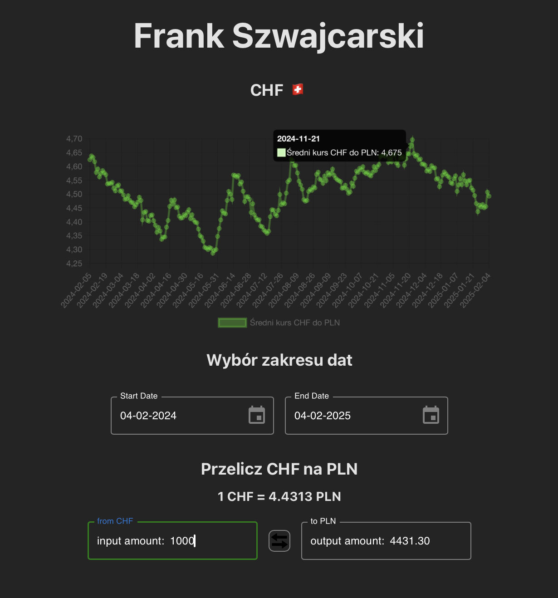

# 💱 Currency Exchange Tracker  

🚀 A modern **React + TypeScript + Vite** application that tracks **exchange rates for over 30 currencies** using data from the **NBP API**.  
📊 Includes **interactive charts, a currency converter, and a date range selector** for historical exchange rates.  

💡 **Created as a technical task during the recruitment process for one of the large financial companies.**  
📌 The position went to another skilled candidate, but this project is still worth sharing!⚡

---

## ✨ Features  

✅ **Real-time exchange rate tracking** for over 30 currencies 🌍  
✅ **Interactive charts** with customizable date ranges 📈  
✅ **Two-way currency converter** (PLN ⇄ selected currency) 🔄  

---

## 🛠️ Tech Stack  

🔹 **Frontend:** Vite + React + TypeScript  
🔹 **Styling:** Tailwind CSS  
🔹 **Data Fetching:** axios + @tanstack/react-query  
🔹 **Charts:** chart.js  
🔹 **Date picking:** mui


---

## 📷 Screenshots  

### 🌍 Homepage  


### 📈 Details  
  


---

## 🚀 Getting Started  

🐑 Clone the repository:  
```sh
git clone https://github.com/mwx27/currencies.git
cd currencies
```
📦 Install packages:  
```sh
yarn install
```
🏁 Start the development server:  
```sh
yarn dev
```

🔹 The app will be available at: http://localhost:5173

## 📡 Deployment

The application is **live on Vercel**:
  🔗 **[Live Demo](https://currencies-chi.vercel.app/)**

## 👨‍💻 Author

🧑‍💻 Maciej Wojda  
📧 Email: [mwx27@protonmail.com](mailto:mwx27@protonmail.com)  
🔗 GitHub - this repo: [https://github.com/mwx27/currencies/](https://github.com/mwx27/currencies)  
🔗 GitHub - profile [https://github.com/mwx27/](https://github.com/mwx27)  
🔗 LinkedIn: [https://www.linkedin.com/in/maciej-wojda/](https://www.linkedin.com/in/maciej-wojda/)  

👍 If you like this project, consider giving it a ⭐ on GitHub! This will motivate me to keep improving it!

💼 **Open to new opportunities!**  
📬 Feel free to reach out 
